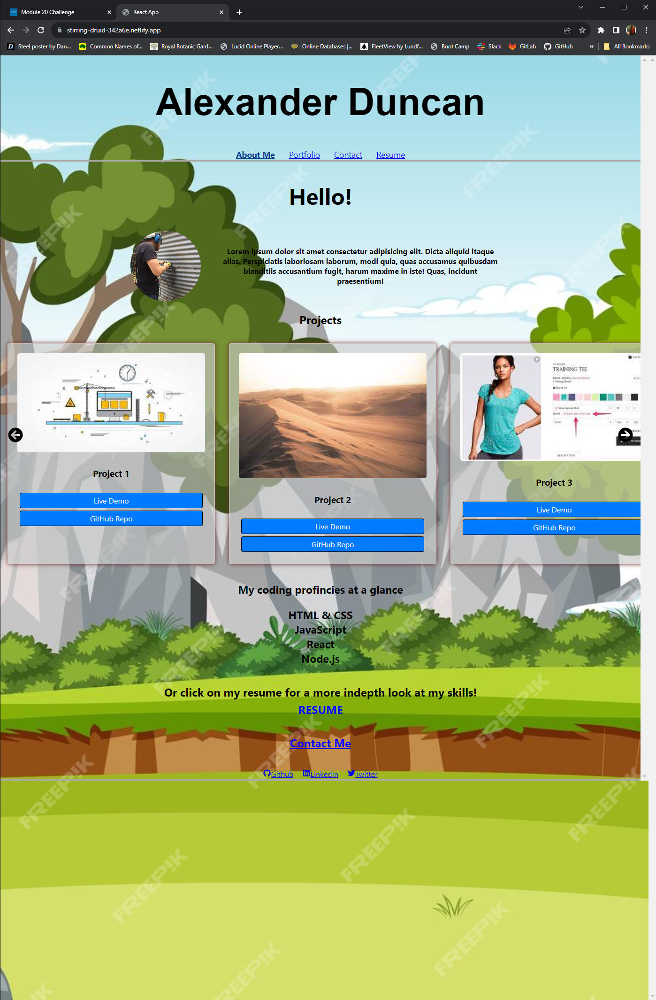

# Week20 Challange React Portfolio

## Description
To create a single page web application useing React. This application could be used to showcase your projects similar to a portfolio

## Table of Contents
- [Installation](#installation)
- [Usage](#usage)
- [Contributing](#contributing)
- [Tests](#tests)
- [License](#license)
- [Questions](#questions)

## Installation
the the root of the applicatoin enter 'npm install' in your terminal, proceeded by npm start.

## Usage
To showcase past and future project that you would like to present to the public, to demonstrate your abilities.

## Contributing

## Tests

## License

## Screenshots

## For Questions contact:
GitHub: [alexanderduncan1@github.com](https://github.com/alexanderduncan1@github.com)
Email: hellstern@gmail.com
